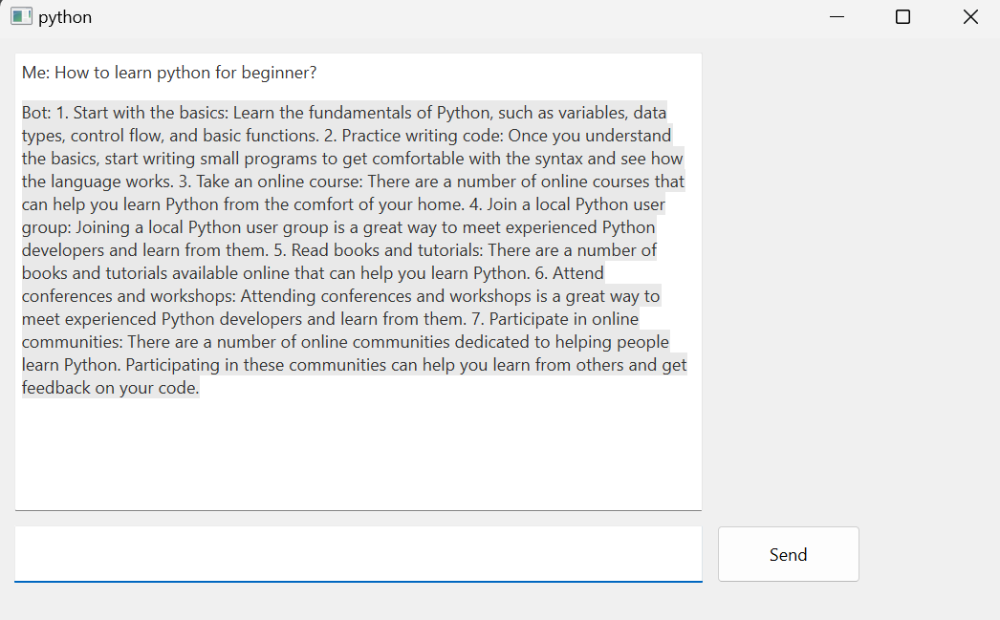

# Build an Intelligent ChatBot with ChatGPT and PyQt

## Project Description

**Overview :**  
The project will result in an intelligent chatbot application that combines the language generation capabilities of ChatGPT with a user-friendly PyQt-based interface. Users will be able to interact with the chatbot in a natural and intuitive manner.

**Challenges :**  
Build an Intelligent ChatBot with ChatGPT and PyQt using Python

## Project Goal

The aim of this project is to create a sophisticated chatbot application that leverages the powerful language generation capabilities of ChatGPT, combined with a user-friendly graphical interface built using PyQt.

## Tools & Library Used

 &nbsp;

## Project Result

[Click here to get full code](https://github.com/nickenshidqia/Build_Intelligent_ChatBot_with_ChatGPT_and_PyQt/blob/0822e99ebc79b50e19c74562aaccb7ee4621eda1/main.py)

### Key Features :

- **ChatGPT Integration:** Integrate with the OpenAI platform to enable seamless communication between the application and ChatGPT.
- **PyQt GUI Design:** Implement chat windows, user input fields, and interactive elements to create a user-friendly experience.

